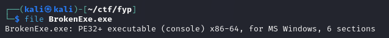

# Rev - Broken Exe
**Challenge Details**

Broken Exe
The exe file is broken, could you help me to fix it?

Category: rev

Points: 250

---
In this challenge we are given an exe file



Running it doesn't work


When trying to open with IDA we get these messages:


Checking with PETools:


The .text section has a Raw Offset of FFFFFFFF, probably the source of the previous errors. To fix it we can use a hex editor and find the .text section header


According to the PE format, the pointer to the raw data should be at offset 20. We can find the bytes FF FF FF FF there.
From PETools we know that the raw size is 1200, so we set the pointer value to the pointer of the next section - 1200 = 400


after this we can run the file


Now decompiling in IDA we find the following function:
```c
int sub_1400010E0()
{
  __m128 v0; // xmm2@1
  signed __int64 v1; // rax@1
  __m128i v2; // xmm1@1
  __m128i v3; // xmm0@1
  __m128i v4; // xmm1@1
  __m128i v5; // xmm2@1
  int v6; // eax@3
  const char *v7; // rcx@3
  __int64 v9; // [sp+0h] [bp-89h]@5
  __int128 Buf2; // [sp+20h] [bp-69h]@1
  __int128 v11; // [sp+30h] [bp-59h]@1
  __int128 v12; // [sp+40h] [bp-49h]@1
  int v13; // [sp+50h] [bp-39h]@1
  int v14; // [sp+54h] [bp-35h]@1
  int v15; // [sp+58h] [bp-31h]@1
  __m128 Buf1; // [sp+60h] [bp-29h]@1
  __m128 v17; // [sp+70h] [bp-19h]@1
  __m128 v18; // [sp+80h] [bp-9h]@1
  __int64 v19; // [sp+D0h] [bp+47h]@5

  sub_140001020("Enter the flag: ");
  sub_140001080("%99s", &Buf1);
  v0 = (__m128)_mm_load_si128((const __m128i *)&xmmword_1400032D0);
  v1 = 48i64;
  v2 = _mm_load_si128((const __m128i *)&xmmword_1400032C0);
  _mm_storeu_si128((__m128i *)&Buf2, _mm_load_si128((const __m128i *)&xmmword_1400032F0));
  v13 = 1782081646;
  _mm_storeu_si128((__m128i *)&v12, _mm_load_si128((const __m128i *)&xmmword_1400032E0));
  v14 = 1668246841;
  _mm_storeu_si128((__m128i *)&v11, v2);
  v15 = 658206312;
  v3 = (__m128i)_mm_xor_ps(v0, Buf1);
  v4 = (__m128i)_mm_xor_ps(v0, v17);
  v5 = (__m128i)_mm_xor_ps(v0, v18);
  _mm_storeu_si128((__m128i *)&Buf1, v3);
  _mm_storeu_si128((__m128i *)&v17, v4);
  _mm_storeu_si128((__m128i *)&v18, v5);
  do
    Buf1.m128_i8[v1++] ^= 0x5Au;
  while ( v1 < 60 );
  v6 = memcmp(&Buf1, &Buf2, 0x3Cui64);
  v7 = "Correct! You found the flag.\n";
  if ( v6 )
    v7 = "Incorrect flag. Try again.\n";
  sub_140001020(v7);
  return sub_140001200((unsigned __int64)&v9 ^ v19);
}
```
xor :)))

We need the values at 1400032C0, 1400032D0 1400032E0 1400032F0 


now we can reconstruct the flag
```python
xmmword_1400032F0 = [0x6E,0x2A,0x69,0x28,0x05,0x36,0x36,0x69,0x0D,0x21,0x1C,0x0E,0x19,0x0A,0x03,0x1C][::-1]
xmmword_1400032E0 = [0x68,0x6D,0x6A,0x3C,0x69,0x6D,0x6D,0x6F,0x38,0x6E,0x6D,0x3B,0x6C,0x68,0x6A,0x6F][::-1]
xmmword_1400032C0 = [0x38,0x68,0x69,0x3E,0x6B,0x05,0x37,0x6E,0x28,0x63,0x6A,0x28,0x2A,0x05,0x28,0x6B][::-1]
xmmword_1400032D0 = 0x5A
expected = []
flag = xmmword_1400032F0 + xmmword_1400032C0 + xmmword_1400032E0
flag[48:52] = (1782081646).to_bytes(4, byteorder='little')
flag[52:56] = (1668246841).to_bytes(4, byteorder='little')
flag[56:60] = (658206312).to_bytes(4, byteorder='little')
flag = [x ^ 0x5A for x in flag]
print(''.join([chr(x) for x in flag]))
```
<details>
  <summary>Flag</summary>
  FYPCTF{W3ll_r3p41r_pr09r4m_1d32b5026a74b5773f07242b0c75924a}
</details>
